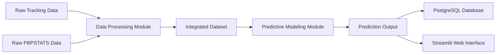
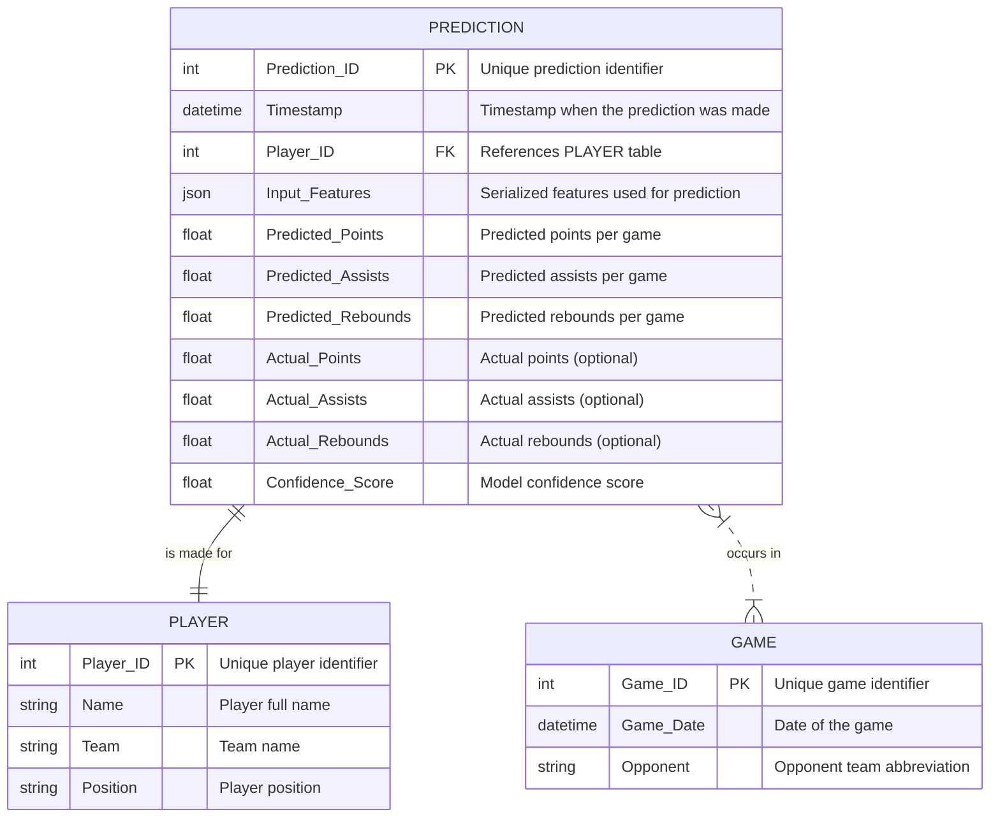

# Engineering Requirements Document (ERD)  
## HoopTrax: NBA Performance Prediction & Analysis App

---

## 1. Introduction

This document outlines the technical requirements, system architecture, and detailed database design for HoopTrax. It translates the high-level vision provided in the Project Design Document (PDD) into actionable engineering specifications for implementation.

---

## 2. System Architecture

### 2.1 High-Level Architecture

The system is divided into several interconnected layers:

- **Data Ingestion & Processing Layer:**  
  - Loads raw datasets (Tracking Data and PBPSTATS).  
  - Cleans, preprocesses, and engineers features.

- **Integration & Modeling Layer:**  
  - Merges processed data to form an integrated dataset.
  - Trains predictive models (e.g., EPV, player performance models).

- **Application & Presentation Layer:**  
  - Interactive web interface (Streamlit app) for user input and prediction display.
  - Logging module that records each prediction into a PostgreSQL database.

- **Deployment Layer:**  
  - Containerization using Docker and orchestration with Docker Compose.

### 2.2 Data Flow Diagram

---

## 3. Hardware and Software Requirements

- **Hardware Requirements:**  
  - Standard development and production servers (or cloud instances) with at least 8 GB RAM, multi-core CPU, and SSD storage.

- **Software Requirements:**  
  - Python 3.8+  
  - PostgreSQL 12+  
  - Docker and Docker Compose  
  - Relevant Python libraries (Pandas, NumPy, PyTorch/TensorFlow, Streamlit, etc.)

---

## 4. Detailed Database Design & ERD

The PostgreSQL database will serve as the logging and historical storage layer for predictions. Below is the detailed Entity-Relationship Diagram (ERD).

### 4.1 ERD Diagram

### 4.2 Explanation

- **PLAYER Table:**  
  Contains static data about each player.

- **PREDICTION Table:**  
  Logs every prediction with details about input features, predicted values, and (when available) actual outcomes.

- **GAME Table (Optional):**  
  Provides game-level context. Linking predictions to specific games enables further analysis of performance in different game scenarios.

---

## 5. Module Specifications

### 5.1 Data Processing Modules
- **tracking_preprocessing.py:**  
  Functions to load and clean tracking data, compute time differences, spatial differences, Euclidean distance, and velocity.

- **pbp_preprocessing.py:**  
  Functions to load and clean play-by-play data, convert time fields, and compute event duration and scoring differentials.

### 5.2 Integration Module
- **merge_datasets.py:**  
  Merges processed tracking and PBPSTATS data based on common keys (e.g., GAME_ID, timestamps).

### 5.3 Modeling Module
- **epv_model.py:**  
  Contains model training, evaluation, and prediction functions for EPV and performance forecasting.

### 5.4 Visualization Module
- **visualizations.py:**  
  Scripts for generating EDA plots and dashboards to support both development and end-user insights.

---

## 6. Security and Performance Requirements

- **Security:**  
  - Secure database connections using SSL/TLS.  
  - Ensure sensitive data (if any) is encrypted.  
  - Follow best practices for container security.

- **Performance:**  
  - Optimize data processing pipelines to handle high-frequency tracking data.  
  - Ensure low latency for real-time predictions in the web interface.  
  - Use indexing on critical database fields (e.g., Player_ID, Timestamp) to speed up queries.

---

## 7. Deployment Requirements

- **Containerization:**  
  - Use Docker to containerize the application, ensuring consistency across environments.
  
- **Orchestration:**  
  - Use Docker Compose to manage multi-container deployment (e.g., app container and PostgreSQL database).

- **CI/CD Pipeline:**  
  - (Optional) Implement continuous integration and deployment pipelines to automate testing and deployment.

---

## 8. Scalability and Maintainability

- **Modular Codebase:**  
  - Ensure each module (data processing, modeling, UI) is decoupled for ease of updates and maintenance.
  
- **Future Data Integration:**  
  - Design the system so that additional datasets (such as SHOTDETAIL or aggregated NBASTATS) can be integrated with minimal changes.

- **Database Scalability:**  
  - Plan for horizontal scaling of the PostgreSQL database as prediction logs grow.

---

## 9. Conclusion

This Engineering Requirements Document outlines the technical specifications for HoopTrax, detailing the system architecture, software/hardware needs, detailed database design (with a full ERD), and the functional modules that will drive the application. It provides a clear blueprint for developers and stakeholders to implement a robust, scalable, and secure NBA performance prediction system.